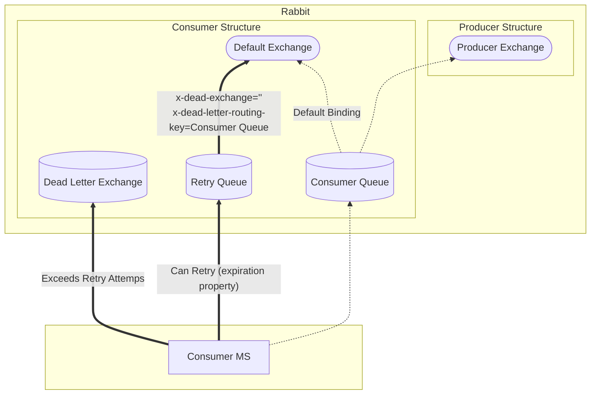

## Retry Delayed Without X-Delay Plugin

```mermaid
graph BT
    subgraph Rabbit;
        subgraph Producer Structure; 
            A([Producer Exchange]);
        end
        subgraph ide1 [Consumer Structure];
            F[(Dead Letter Exchange)];
            C[(Retry Queue)] == "x-dead-exchange=''\nx-dead-letter-routing-key=Consumer Queue" ==> D([Default Exchange]);
            E[(Consumer Queue)] -.Default Binding.-> D;
            E -.-> A;    
        end
    end;
    subgraph  
            ms[Consumer MS] -..-> E;  
            ms == "Can Retry (expiration property)" ==> C;
            ms == Exceeds Retry Attemps==> F;
    end;
```
